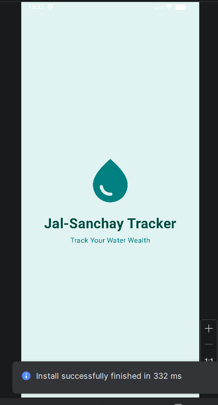
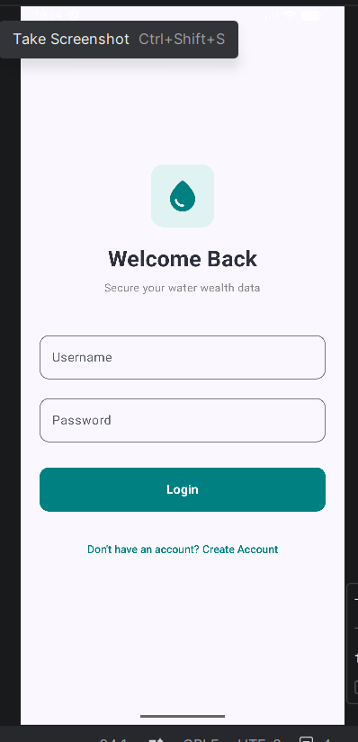
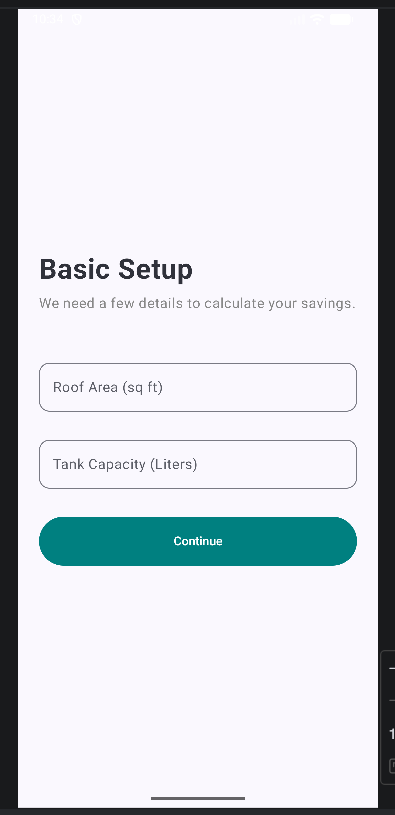
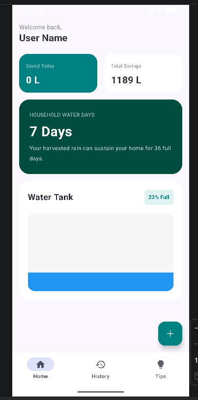
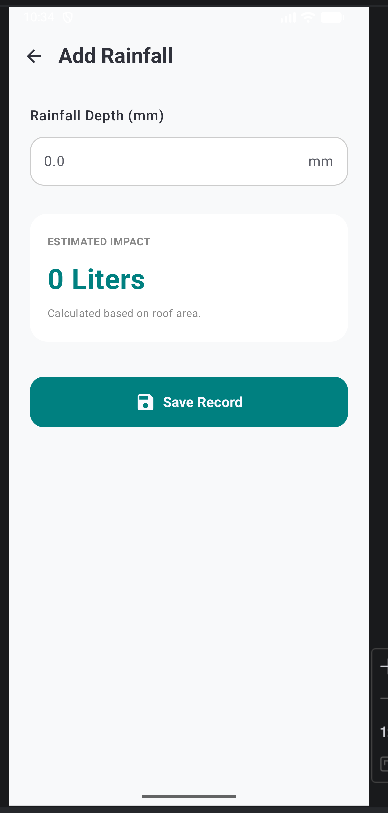
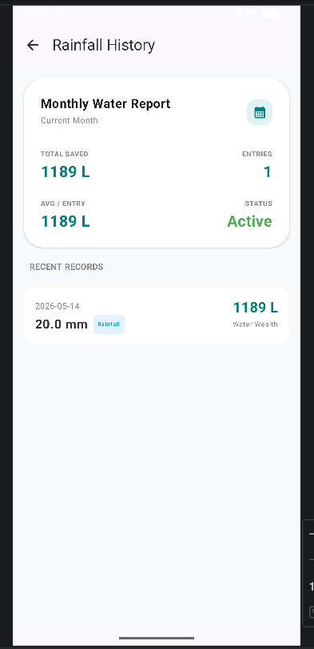
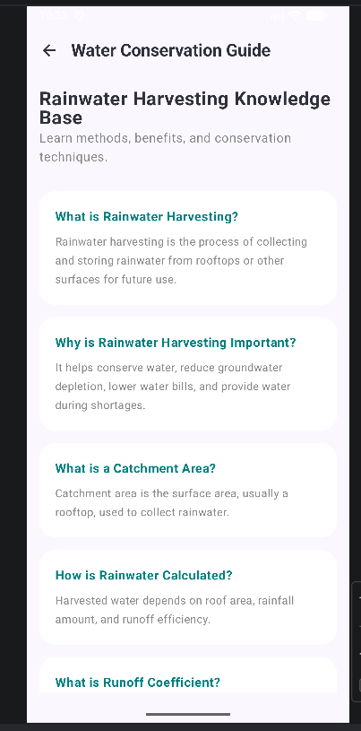

# JalSanchay Tracker

## Problem Statement
JalSanchay Tracker is an Android application developed to promote rainwater harvesting and water conservation by tracking rainfall data and estimating water savings.

## Features
- Rainfall data entry
- Rainwater harvesting calculation
- Dashboard with dynamic updates
- Water tank level monitoring
- Rainfall history tracking
- Offline data storage using RoomDB and DataStore
- Water conservation tips section

## Tech Stack
- Kotlin
- Jetpack Compose
- Room Database
- DataStore
- Android Studio

## Installation
1. Clone repository
2. Open in Android Studio
3. Sync Gradle
4. Run application on emulator/device

## Project Structure
- screens/
- data/
- ui.theme/
- AppViewModel.kt
- MainActivity.kt

## Screenshots

### Splash Screen

### Login Page

### Setup Screen

### Dashboard

### Rainfall Entry

### History Screen

### Tips Screen

